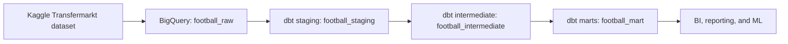

# Football Player Performance Analysis

An end-to-end football analytics transformation project built with BigQuery and dbt. The project converts the public [Football Data from Transfermarkt](https://www.kaggle.com/datasets/davidcariboo/player-scores) dataset into tested, analytics-ready dimensions and fact tables for BI, reporting, and machine learning.

## Project Status

Validated against BigQuery on June 12, 2026:

| Check | Result |
| --- | ---: |
| dbt models | 28 |
| Source and data tests | 105 passed |
| Mart build | 9 models and 45 tests passed |
| Test warnings and errors | 0 |
| Non-null fact-to-dimension orphan keys | 0 |

The dbt transformation logic and defined quality checks pass completely. Raw source data still contains documented missing values; see [Data Quality](docs/DATA_QUALITY.md).

## Architecture



| Layer | Materialization | Models | Purpose |
| --- | --- | ---: | --- |
| Raw | BigQuery source tables | 12 | Original imported dataset |
| Staging | Views | 12 | Cleaning, normalization, and stable column naming |
| Intermediate | Views | 7 | Reusable business calculations and aggregations |
| Marts | Tables | 9 | Analytics-ready dimensions and facts |

Detailed lineage, grains, and model responsibilities are documented in [Architecture and Model Catalog](docs/ARCHITECTURE.md).

## Analytics Marts

| Model | Grain | Purpose |
| --- | --- | --- |
| `dim_players` | One row per player | Current and historical player dimension |
| `dim_clubs` | One row per club | Current and historical club dimension |
| `dim_competitions` | One row per competition | Competition reference dimension |
| `fct_player_performance` | One row per player | All-time player performance |
| `fct_player_career_timeline` | Player, season, competition | Seasonal player performance and market value |
| `fct_club_performance` | One row per club | All-time club results |
| `fct_competition_performance` | One row per competition | Competition-level match metrics |
| `fct_market_value_history` | Player and valuation date | Player market value history |
| `fct_transfers` | One row per transfer record | Transfer fees and fee-to-value comparisons |

## Key Transformation Rules

- Sentinel identifiers such as `-1` are normalized to `NULL`.
- Empty event descriptions and lineup positions are normalized to `NULL`.
- Invalid player heights outside 100-250 cm are rejected.
- Transfer monetary fields use BigQuery `NUMERIC`.
- Player age is calculated as completed years.
- Latest transfer selection uses deterministic tie-breakers.
- Seasonal market value is the latest valuation on or before the player's last game in that season and competition.
- Dimensions include historical players and clubs referenced by facts, preventing non-null orphan keys.

## Quick Start

### Prerequisites

- Python 3.10+
- `dbt-bigquery` 1.11+
- A Google Cloud project with BigQuery access
- The raw dataset loaded into a BigQuery dataset named `football_raw`

### Configure a Local Profile

Create a dbt profile outside the repository. Never commit service account credentials.

```yaml
default:
  target: dev
  outputs:
    dev:
      type: bigquery
      method: service-account
      project: YOUR_GCP_PROJECT_ID
      dataset: football
      keyfile: /absolute/path/to/service-account.json
      threads: 4
      location: EU
```

The configured base dataset produces:

- `football_staging`
- `football_intermediate`
- `football_mart`

Update the source `database` in [`models/staging/sources.yml`](models/staging/sources.yml) when using a different Google Cloud project.

### Run and Validate

```bash
dbt debug
dbt build
```

Useful scoped commands:

```bash
dbt build --select path:models/staging
dbt build --select path:models/intermediate
dbt build --select path:models/marts
dbt test
```

See the [Runbook](docs/RUNBOOK.md) for deployment and troubleshooting procedures.

## Data Quality Strategy

The project combines:

- Source `not_null` and `unique` checks
- Model grain checks
- Referential integrity checks
- Layer-to-layer row coverage checks
- Recalculation checks against staging data
- Mart-to-intermediate and mart-to-staging value reconciliation
- Business-rule checks for age, transfers, market values, and sentinel normalization

See [Data Quality](docs/DATA_QUALITY.md) for current results and known source limitations.

## Repository Structure

```text
.
|-- models/
|   |-- staging/
|   |-- intermediate/
|   `-- marts/
|-- tests/
|-- docs/
|-- analyses/
|-- macros/
|-- seeds/
|-- snapshots/
`-- dbt_project.yml
```

## Documentation

- [Architecture and Model Catalog](docs/ARCHITECTURE.md)
- [Data Quality and Validation](docs/DATA_QUALITY.md)
- [Operations Runbook](docs/RUNBOOK.md)

## License

This repository is licensed under the terms in [LICENSE](LICENSE). The source dataset remains subject to its own terms and attribution requirements.
