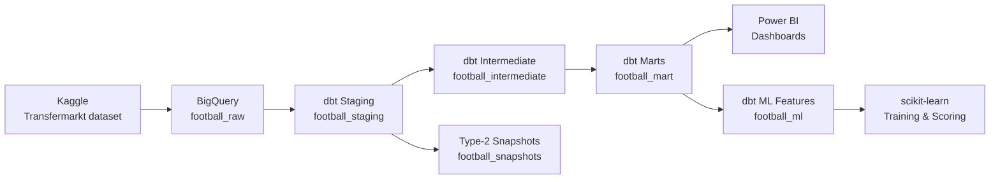
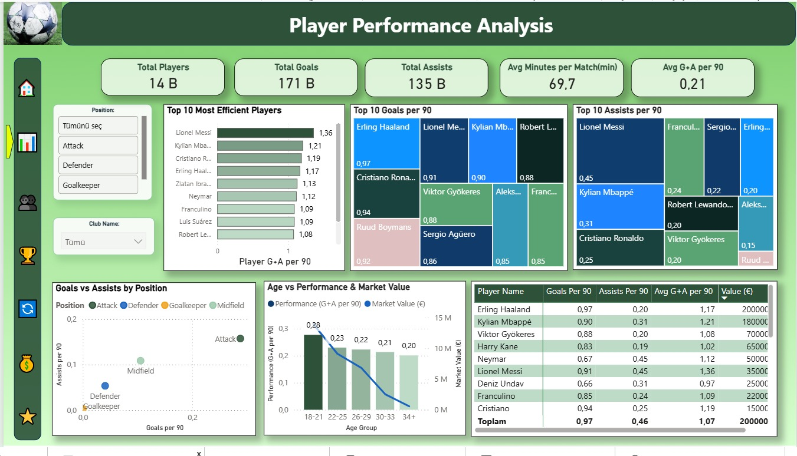
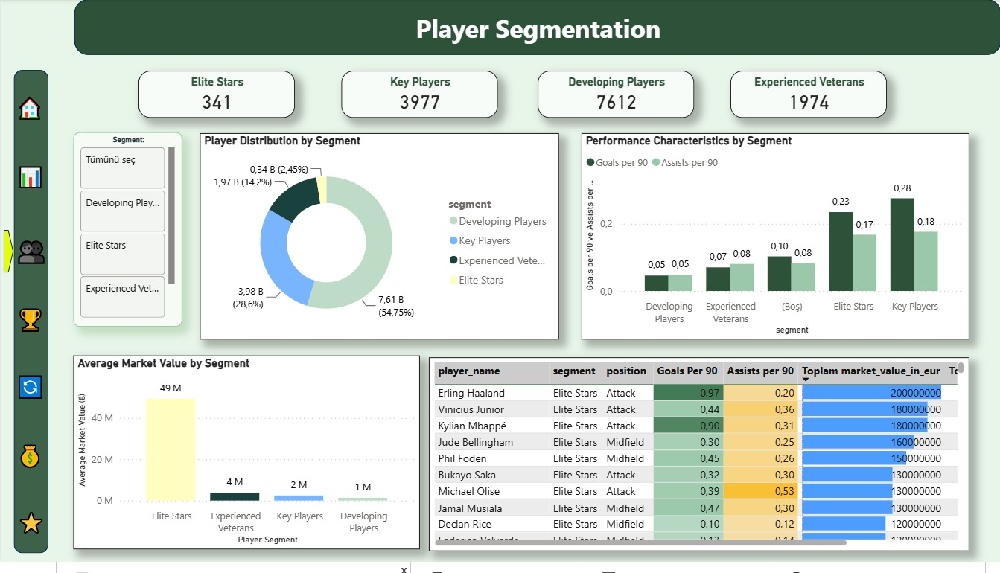
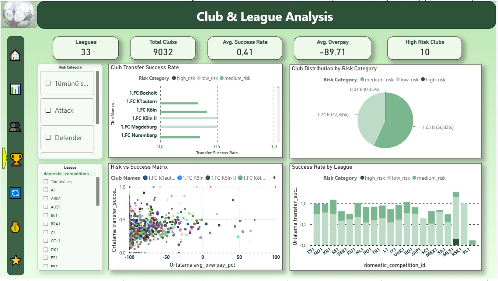
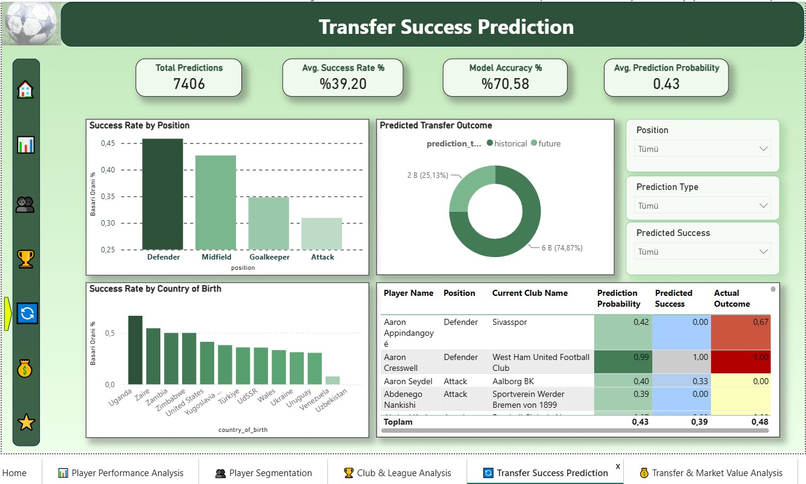
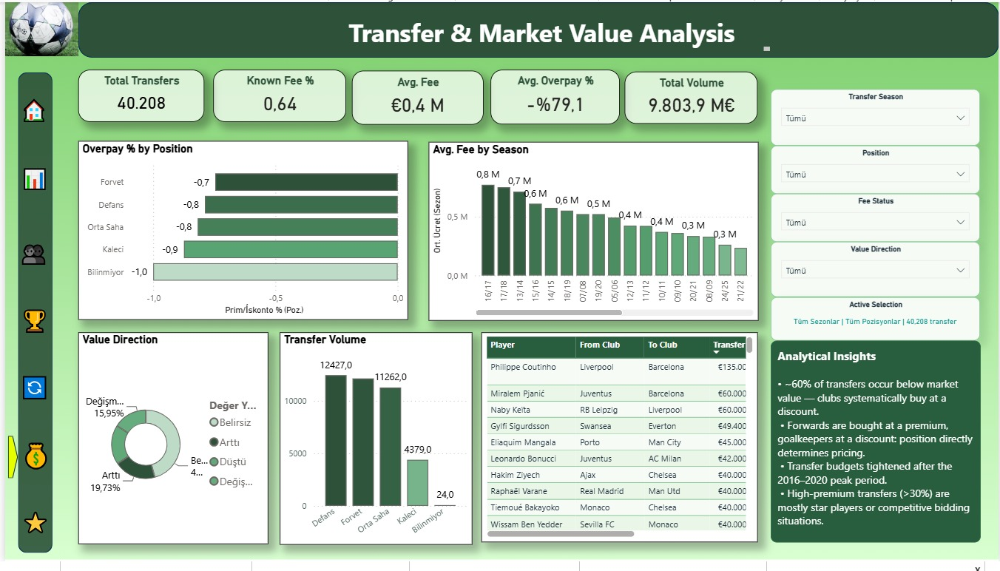
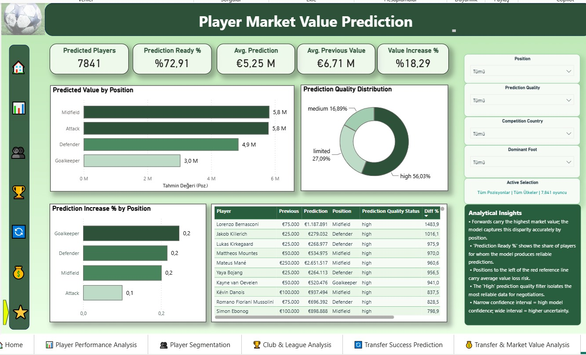

<p align="center">
  
  
  
  
  
  
</p>

<h1 align="center">Football Player Performance Analysis</h1>

<p align="center">
  An end-to-end football analytics platform — from raw Transfermarkt data to production ML predictions and interactive Power BI dashboards.
</p>

<p align="center">
  <a href="#architecture">Architecture</a> •
  <a href="#dashboard-preview">Dashboard</a> •
  <a href="#ml-model">ML Model</a> •
  <a href="#quick-start">Quick Start</a> •
  <a href="#documentation">Documentation</a>
</p>

---

## Project Status

Validated against BigQuery — June 15, 2026

| Check | Result |
|---|---:|
| dbt models | **46** |
| Full CI validation resources | **292** |
| Source and data tests | **241 / 241 passed** |
| Source freshness | **12 / 12 sources passed** |
| Mart models (partitioned tables) | **25** |
| ML feature models + tests | **2 models / 43 tests** |
| Snapshots / analyses / exposures | **2 / 5 / 3** |
| Semantic models / governed metrics | **2 / 7** |
| Model documentation | **46 / 46** |
| Column documentation | **878 / 878** |
| Test warnings and errors | **0** |
| Non-null fact-to-dimension orphan keys | **0** |

---

## Architecture



| Layer | Materialization | Models | Purpose |
|---|---|---:|---|
| Raw | BigQuery source tables | 12 | Original imported dataset |
| Staging | Views | 12 | Cleaning, normalization, stable column naming |
| Intermediate | Views | 7 | Reusable business calculations and aggregations |
| Marts | Partitioned tables | 25 | Analytics-ready dimensions, facts, cohorts, labels |
| ML | Tables | 2 | Leakage-safe training and current-scoring features |

Full lineage, grains, and model responsibilities → [Architecture & Model Catalog](docs/ARCHITECTURE.md)

---

## Dashboard Preview

The Power BI report contains **9 pages** and **2 drill-through pages**, all backed by governed BigQuery marts.

### Player Performance Analysis


> 14B total players · 171B goals · 135B assists · Avg 69.7 min/match · Avg G+A per 90: 0.21
>
> Top-10 efficiency ranking (G+A per 90), treemap breakdowns by goals and assists per 90, position scatter, and age vs. performance & market value trend.

---

### Player Segmentation


> **341** Elite Stars · **3,977** Key Players · **7,612** Developing Players · **1,974** Experienced Veterans
>
> Segment distribution, performance characteristics by segment (goals/assists per 90), and average market value by segment — Elite Stars average **€49M**, Developing Players **€1M**.

---

### Club & League Analysis


> **33** leagues · **9,032** clubs · Avg. success rate: **0.41** · Avg. overpay: **-89.71** · High-risk clubs: **10**
>
> Club transfer success rate ranking, risk vs. success scatter matrix, and success rate by league. **56.82%** of clubs are low-risk, **42.83%** medium-risk, **0.35%** high-risk.

---

### Transfer Success Prediction


> **7,406** predictions · Avg. success rate: **39.20%** · Model accuracy: **70.58%** · Avg. prediction probability: **0.43**
>
> Success rate by position (Defenders: 0.45, highest), success rate by country of birth, predicted vs. actual outcome table. **74.87%** of predictions are historical, **25.13%** future.

---

### Transfer & Market Value Analysis


> **40,208** transfers · Known fee rate: **64.2%** · Avg. fee: **€0.4M** · Avg. overpay: **-79.1%** · Total volume: **€9,803.9M**
>
> Clubs systematically acquire players at **~79% below market value** across all positions. Forwards carry the smallest discount (-74.6%), goalkeepers the largest (-87.4%). Transfer budgets peaked at **€0.8M/season** in 2016/17 and have since tightened to **€0.3M**. Only **19.7%** of transfers result in post-transfer value appreciation.

---

### Player Market Value Prediction (ML)


> **7,841** players scored · Decision-ready: **72.9%** · Avg. prediction: **€5.3M** · Avg. previous: **€6.7M** · Value growth: **+18.3%**
>
> ML predictions by position (Midfield & Forward: €5.8M, Goalkeeper: €3.0M), quality distribution (**56%** high, **17%** medium, **27%** limited), and per-player confidence intervals. Goalkeepers show the highest predicted value growth (**+24.7%**) — the most systematically underpriced segment.

---

## ML Model

### Overview

A production `HistGradientBoostingRegressor` pipeline that predicts current player market value using leakage-safe, season-lagged features. The model is retrained weekly and routes predictions through a quality-based ensemble.

### Performance (v5 ensemble — approved_with_monitoring)

| Metric | Ensemble | Baseline (prev. value) |
|---|---:|---:|
| MAE | **€781,409** | €867,156 |
| RMSE | **€2,039,156** | €2,248,309 |
| R² | **0.9756** | 0.9704 |
| WAPE | **12.51%** | 13.88% |

### Quality-Segment Routing

| Segment | Players | Method | Rationale |
|---|---:|---|---|
| High | 4,393 | 80% model + 20% baseline | Rich data — model is reliable |
| Medium | 1,967 | 100% model | Sufficient data — full model |
| Limited | 5,215 | 100% baseline | Sparse data — honest fallback |

### Feature Groups

- **Age** — strongest single predictor; value peaks at ages 24–27
- **Position & sub-position** — Forward/10 carries statistically significant premium
- **Performance** — minutes played, goals/90, assists/90, competition level
- **Valuation history** — previous highest value, valuation count, days since last valuation

Training set: **90,704** player-season rows. Leakage protection enforced by `assert_ml_features_precede_target`.

Full methodology, commands, interpretation, and limitations → [Player Market Value ML](docs/PLAYER_MARKET_VALUE_ML.md)

---

## Analytics Marts

<details>
<summary><strong>Dimensions (6 models)</strong></summary>

| Model | Grain | Purpose |
|---|---|---|
| `dim_players` | One row per player | Current and historical player dimension |
| `dim_clubs` | One row per club | Current and historical club dimension |
| `dim_competitions` | One row per competition | Competition reference dimension |
| `dim_national_teams` | One row per national team | National-team reference dimension |
| `dim_date` | One row per calendar date | Continuous date dimension for time intelligence |
| `time_spine_daily` | One row per calendar date | Governed Semantic Layer time spine |

</details>

<details>
<summary><strong>Facts (19 models)</strong></summary>

| Model | Grain | Purpose |
|---|---|---|
| `fct_player_performance` | One row per player | All-time player performance |
| `fct_player_career_timeline` | Player, season, competition | Seasonal performance and market value |
| `fct_club_performance` | One row per club | All-time club results |
| `fct_competition_performance` | One row per competition | Competition-level match metrics |
| `fct_market_value_history` | Player and valuation date | Player market value history |
| `fct_transfers` | One row per transfer | Transfer fees and fee-to-value comparisons |
| `fct_transfer_market_value_analysis` | One row per transfer | Detailed fee, nearest valuation, post-transfer value |
| `fct_transfer_fixed_horizon_outcomes` | One historical transfer | 90/180/365-day comparable outcomes |
| `fct_transfer_cohort_performance` | Cohort and horizon | Cohort statistics with confidence intervals |
| `fct_transfer_success_labels` | One 365-day transfer | Binary success label for ML |
| `fct_club_risk_profile` | One destination club | Transfer success, coverage, and risk profile |
| `fct_club_season_performance` | Club, season, competition | Seasonal club performance |
| `fct_club_transfer_portfolio` | Club and transfer season | Spend, income, premium, outcome portfolio |
| `fct_match` | One match | Match result and context |
| `fct_player_match_performance` | One appearance | Player-match performance and result |
| `fct_player_rolling_form` | One appearance | Trailing-5-appearance form |
| `fct_agent_portfolio` | One agent | Current represented-player portfolio |
| `fct_analytics_refresh_audit` | One dbt invocation | Append-only volume and coverage audit |
| `fct_data_coverage_bias` | Coverage segment | Missingness and selection-bias risk |

</details>

---

## Quick Start

### Prerequisites

- Python 3.10+
- `dbt-bigquery` 1.11.1
- Google Cloud project with BigQuery access
- Raw Transfermarkt dataset loaded into `football_raw` BigQuery dataset

### 1. Install dependencies

```bash
pip install -r requirements.txt
```

### 2. Configure your dbt profile

Copy the example profile and fill in your credentials (never commit service account files):

```bash
cp profiles.yml.example ~/.dbt/profiles.yml
```

```yaml
default:
  target: dev
  outputs:
    dev:
      type: bigquery
      method: service-account
      project: YOUR_GCP_PROJECT_ID
      dataset: football
      keyfile: /absolute/path/to/service-account.json
      threads: 4
      location: EU
```

Environment variable overrides: `DBT_PROJECT_ID`, `DBT_KEYFILE`, `DBT_DATASET`, `DBT_SOURCE_DATABASE`.

### 3. Build and validate

```bash
dbt debug
dbt source freshness --selector raw_sources
dbt build
dbt docs generate && dbt docs serve
```

### 4. Scoped builds

```bash
dbt build --select path:models/staging
dbt build --select path:models/marts
dbt build --select tag:ml
dbt test
```

### 5. Run the ML pipeline

```bash
pip install -r requirements-ml.txt
python scripts/train_player_market_value.py
python scripts/verify_ml_artifact.py
python scripts/verify_published_ml_outputs.py
```

Full deployment and troubleshooting → [Operations Runbook](docs/RUNBOOK.md)

---

## Power BI Dashboard

The report is stored as a PBIP project at `powerbi/workspace/FootballPlayerAnalysis/` in **PBIR v4** format. Open `FootballPlayerAnalysis.pbip` in Power BI Desktop June 2026 (v2.155+).

### Report Pages

| Page | Description |
|---|---|
| 🏠 Home | Landing page with navigation |
| 📊 Player Performance Analysis | KPIs, top-10 rankings, position scatter, age curve |
| 👥 Player Segmentation | Elite Stars / Key Players / Developing / Veterans segmentation |
| 🏆 Club & League Analysis | Risk matrix, success rates, league comparison |
| 🔄 Transfer Success Prediction | ML-based transfer outcome prediction |
| 💰 Transfer & Market Value Analysis | Fee vs. value, premium/discount, volume by season |
| ⭐ Player Market Value Prediction | ML predictions, quality segments, confidence intervals |
| ML Model Reliability | Backtest results, feature importance, model registry |

### Drill-Through Pages (hidden in view mode)

| Page | Trigger |
|---|---|
| Transfer Player Detail | Right-click player name in any transfer table → **Drill through** |
| Player Prediction Detail | Right-click player name in ML prediction table → **Drill through** |

---

## Automation

Three GitHub Actions workflows cover the full lifecycle:

| Workflow | Trigger | Purpose |
|---|---|---|
| `dbt-ci.yml` | Push / PR / daily | Source freshness, full build, docs deploy, smoke test |
| `ml-production.yml` | Weekly / manual | Feature build → train → validate → score → publish |
| `docs-deploy.yml` | Push to `main` | Generate and deploy dbt docs to GitHub Pages |

The workflow uses `GCP_SERVICE_ACCOUNT_JSON` repository secret. Pull requests get isolated temporary BigQuery datasets that are deleted after the run.

---

## Data Quality Strategy

- Source `not_null`, `unique`, and freshness checks (7-day warning / 14-day error SLA)
- Model grain and referential integrity checks
- Layer-to-layer row coverage and value reconciliation
- Business-rule checks (age, sentinel normalization, market value sequencing)
- Fixed-horizon transfer outcome checks
- Cohort reliability and coverage-bias diagnostics
- Volume anomaly detection via append-only audit fact
- 4 ML assertions: leakage, coverage, business rules, scoring readiness
- Complete model and column documentation enforcement in CI

Full test results and known source limitations → [Data Quality](docs/DATA_QUALITY.md)

---

## Key Transformation Rules

- Sentinel identifiers (`-1`) normalized to `NULL`
- Transfer monetary fields use BigQuery `NUMERIC`
- Player age calculated as completed years with birthday-aware logic
- Transfer analysis uses transfer-record market value when available, otherwise latest prior valuation
- Future-dated transfer records retained and explicitly flagged (`is_future_transfer`)
- `dim_date` covers every date from earliest source through today
- Power BI-safe `*_display`, `has_*`, and record-type fields prevent null propagation in visuals

---

## Repository Structure

```text
.
├── models/
│   ├── staging/          # 12 views — cleaning & normalization
│   ├── intermediate/     # 7 views — business aggregations
│   ├── marts/            # 25 partitioned tables — analytics-ready
│   └── ml/               # 2 tables — leakage-safe ML features
├── tests/                # 241 custom data tests
├── snapshots/            # Type-2 player & club profile snapshots
├── analyses/             # Ad-hoc SQL analyses & decision reports
├── macros/               # Reusable dbt macros
├── seeds/                # Reference seed data
├── scripts/
│   ├── train_player_market_value.py
│   ├── check_ml_pipeline.py
│   ├── verify_ml_artifact.py
│   └── verify_published_ml_outputs.py
├── powerbi/
│   ├── workspace/FootballPlayerAnalysis/   # PBIP project (PBIR v4)
│   ├── MODEL_SPEC.md
│   └── MEASURES.dax
├── docs/
│   ├── assets/screenshots/                 # Dashboard screenshots
│   ├── ARCHITECTURE.md
│   ├── PLAYER_MARKET_VALUE_ML.md
│   ├── TRANSFER_MARKET_VALUE_ANALYSIS.md
│   ├── KPI_DICTIONARY.md
│   ├── DATA_QUALITY.md
│   ├── POWER_BI_MODELING.md
│   ├── RUNBOOK.md
│   └── PROFESSIONAL_ANALYTICS.md
├── .github/
│   ├── workflows/
│   └── ISSUE_TEMPLATE/
├── dbt_project.yml
├── profiles.yml.example
├── requirements.txt
└── requirements-ml.txt
```

---

## Documentation

| Document | Description |
|---|---|
| [Architecture & Model Catalog](docs/ARCHITECTURE.md) | Full lineage, grains, model catalog, KPI reference, and transfer analysis SQL examples |
| [Player Market Value ML](docs/PLAYER_MARKET_VALUE_ML.md) | Methodology, feature engineering, ensemble design, commands, and limitations |
| [Data Quality](docs/DATA_QUALITY.md) | Test results, coverage metrics, and known source limitations |
| [Power BI Modeling Guide](docs/POWER_BI_MODELING.md) | Relationships, measures, PBIR format, and null-handling guidance |
| [Operations Runbook](docs/RUNBOOK.md) | Deployment, CI scheduling, and troubleshooting procedures |

---

## Contributing

Contributions, issues, and feature requests are welcome. See [CONTRIBUTING.md](CONTRIBUTING.md) for guidelines.

---

## License

Licensed under the terms in [LICENSE](LICENSE). The source Transfermarkt dataset is subject to its own terms and attribution requirements — see [Kaggle: Football Data from Transfermarkt](https://www.kaggle.com/datasets/davidcariboo/player-scores).
