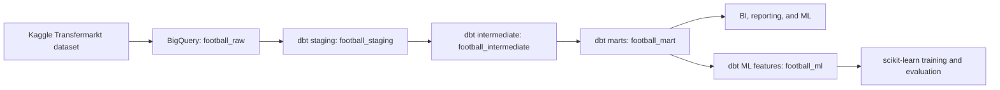

# Football Player Performance Analysis

An end-to-end football analytics transformation project built with BigQuery and dbt. The project converts the public [Football Data from Transfermarkt](https://www.kaggle.com/datasets/davidcariboo/player-scores) dataset into tested, analytics-ready dimensions and fact tables for BI, reporting, and machine learning.

## Project Status

Validated against BigQuery on June 12, 2026:

| Check | Result |
| --- | ---: |
| dbt models | 32 |
| Full dbt build | 235 passed |
| Source and data tests | 203 passed |
| Source freshness | 12 of 12 sources passed |
| Mart build | 11 models and 100 tests passed |
| ML feature build | 2 models and 43 tests passed |
| Model documentation | 32 of 32 models documented |
| Column documentation | 551 of 551 model columns documented |
| Test warnings and errors | 0 |
| Non-null fact-to-dimension orphan keys | 0 |

The dbt transformation logic and defined quality checks pass completely. Raw source data still contains documented missing values; see [Data Quality](docs/DATA_QUALITY.md).

## Architecture



| Layer | Materialization | Models | Purpose |
| --- | --- | ---: | --- |
| Raw | BigQuery source tables | 12 | Original imported dataset |
| Staging | Views | 12 | Cleaning, normalization, and stable column naming |
| Intermediate | Views | 7 | Reusable business calculations and aggregations |
| Marts | Tables | 11 | Analytics-ready dimensions and facts |
| ML | Tables | 2 | Leakage-safe training and current-scoring features |

Detailed lineage, grains, and model responsibilities are documented in [Architecture and Model Catalog](docs/ARCHITECTURE.md).

## Player Market Value Prediction

The project includes a reproducible player market value prediction workflow:

- `football_ml.ml_player_market_value_training` creates one leakage-safe row per player and season.
- `football_ml.ml_player_market_value_scoring` creates one current scoring row per active player in the latest observed season.
- Match-performance and prior-valuation features use only records strictly before the target valuation date.
- Season 2022 selects the ensemble weight; season 2023 independently calibrates the 90% prediction interval.
- Seasons 2024-2025 are held out as the final time-based test set.
- The validated ensemble combines a histogram gradient-boosting model with the previous-market-value baseline.
- Production scoring retrains on all 90,704 labeled rows through 2025 and publishes quality status, prediction intervals, drift metrics, and model-version metadata.

Latest held-out results:

| Metric | Ensemble | Previous-value baseline |
| --- | ---: | ---: |
| MAE | EUR 804,241 | EUR 867,156 |
| RMSE | EUR 2,239,653 | EUR 2,248,309 |
| R2 | 0.9706 | 0.9704 |
| WAPE | 12.88% | 13.88% |

The workflow publishes evaluation predictions, current estimates, segment metrics, feature drift, and an append-only model registry in `football_ml`. See [Player Market Value ML](docs/PLAYER_MARKET_VALUE_ML.md) for methodology, commands, interpretation, and limitations.

## Analytics Marts

| Model | Grain | Purpose |
| --- | --- | --- |
| `dim_players` | One row per player | Current and historical player dimension |
| `dim_clubs` | One row per club | Current and historical club dimension |
| `dim_competitions` | One row per competition | Competition reference dimension |
| `dim_date` | One row per calendar date | Continuous date dimension for Power BI relationships and time intelligence |
| `fct_player_performance` | One row per player | All-time player performance |
| `fct_player_career_timeline` | Player, season, competition | Seasonal player performance and market value |
| `fct_club_performance` | One row per club | All-time club results |
| `fct_competition_performance` | One row per competition | Competition-level match metrics |
| `fct_market_value_history` | Player and valuation date | Player market value history |
| `fct_transfers` | One row per transfer record | Transfer fees and fee-to-value comparisons |
| `fct_transfer_market_value_analysis` | One row per transfer record | Detailed transfer, fee, nearest valuation, and post-transfer value analysis |

## Key Transformation Rules

- Sentinel identifiers such as `-1` are normalized to `NULL`.
- Empty event descriptions and lineup positions are normalized to `NULL`.
- Invalid player heights outside 100-250 cm are rejected.
- Transfer monetary fields use BigQuery `NUMERIC`.
- Detailed transfer analysis uses the transfer-record market value when available and otherwise the latest prior valuation as its comparison baseline.
- Future-dated transfer records are retained and explicitly identified.
- Player age is calculated as completed years.
- Latest transfer selection uses deterministic tie-breakers.
- Seasonal market value is the latest valuation on or before the player's last game in that season and competition.
- Dimensions include historical players and clubs referenced by facts, preventing non-null orphan keys.
- Canonical source `NULL` values remain `NULL`; Power BI-friendly `*_display`, record type, completeness, and `has_*` fields make them safe to consume without inventing data.
- `dim_date` covers every date from the earliest source business date through the latest source date or today, whichever is later.
- Raw source freshness uses BigQuery table last-modified metadata with a 7-day warning and 14-day error SLA.

## Quick Start

### Prerequisites

- Python 3.10+
- `dbt-bigquery` 1.11.1
- A Google Cloud project with BigQuery access
- The raw dataset loaded into a BigQuery dataset named `football_raw`

### Configure a Local Profile

Install the pinned adapter and create a dbt profile outside the repository. Never commit service account credentials.

```bash
pip install -r requirements.txt
```

```yaml
default:
  target: dev
  outputs:
    dev:
      type: bigquery
      method: service-account
      project: YOUR_GCP_PROJECT_ID
      dataset: football
      keyfile: /absolute/path/to/service-account.json
      threads: 4
      location: EU
```

The configured base dataset produces:

- `football_staging`
- `football_intermediate`
- `football_mart`

The repository includes [`profiles.yml.example`](profiles.yml.example). Set `DBT_PROJECT_ID`, `DBT_KEYFILE`, and optionally `DBT_DATASET` and `DBT_SOURCE_DATABASE`.

### Run and Validate

```bash
dbt debug
dbt source freshness --selector raw_sources
dbt build
dbt docs generate
```

Useful scoped commands:

```bash
dbt build --select path:models/staging
dbt build --select path:models/intermediate
dbt build --select path:models/marts
dbt build --select tag:ml
dbt test
```

See the [Runbook](docs/RUNBOOK.md) for deployment and troubleshooting procedures.

## Automation

The [`dbt CI`](.github/workflows/dbt-ci.yml) GitHub Actions workflow:

- Runs source freshness daily without rebuilding models
- Runs freshness, full build, and docs generation on `main`
- Runs a synthetic ML pipeline smoke test before deployment
- Fails when any model or physical model column lacks documentation
- Uses isolated temporary BigQuery datasets for pull requests and deletes them afterward
- Uploads dbt artifacts for 14 days

The repository secret `GCP_SERVICE_ACCOUNT_JSON` is required for the workflow.

## Data Quality Strategy

The project combines:

- Source `not_null` and `unique` checks
- Model grain checks
- Referential integrity checks
- Layer-to-layer row coverage checks
- Recalculation checks against staging data
- Mart-to-intermediate and mart-to-staging value reconciliation
- Business-rule checks for age, transfers, market values, and sentinel normalization
- Complete model and column documentation across staging, intermediate, and mart layers
- Power BI-safe display fields, explicit data-availability flags, and a tested date dimension

See [Data Quality](docs/DATA_QUALITY.md) for current results and known source limitations.

## Repository Structure

```text
.
|-- models/
|   |-- staging/
|   |-- intermediate/
|   `-- marts/
|-- tests/
|-- docs/
|-- scripts/
|-- .github/workflows/
|-- analyses/
|-- macros/
|-- seeds/
|-- snapshots/
`-- dbt_project.yml
```

## Documentation

- [Architecture and Model Catalog](docs/ARCHITECTURE.md)
- [Power BI Modeling Guide](docs/POWER_BI_MODELING.md)
- [Player Market Value ML](docs/PLAYER_MARKET_VALUE_ML.md)
- [Transfer and Market Value Analysis](docs/TRANSFER_MARKET_VALUE_ANALYSIS.md)
- [Data Quality and Validation](docs/DATA_QUALITY.md)
- [Operations Runbook](docs/RUNBOOK.md)

## License

This repository is licensed under the terms in [LICENSE](LICENSE). The source dataset remains subject to its own terms and attribution requirements.
