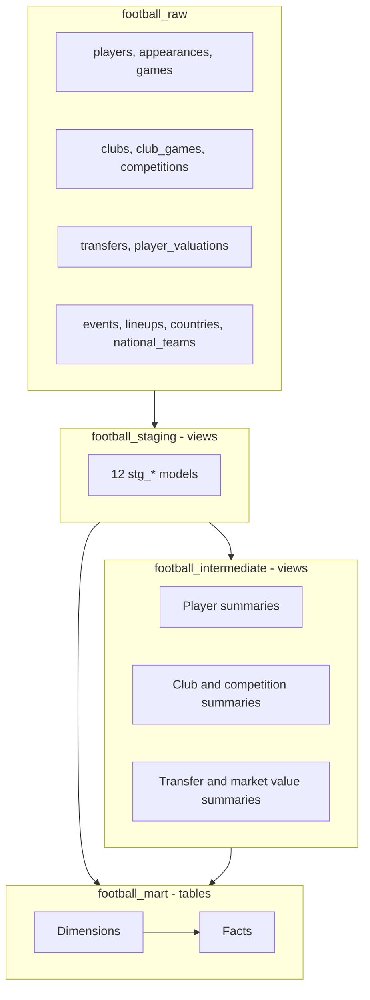

# Architecture and Model Catalog

## Overview

This project follows a layered dbt architecture on BigQuery. Each layer has a narrow responsibility:

1. Raw tables preserve the imported Kaggle dataset.
2. Staging views clean and normalize individual source tables.
3. Intermediate views calculate reusable business metrics.
4. Mart tables expose stable analytics-ready dimensions and facts.



## Dataset and Materialization Layout

| dbt area | BigQuery dataset | Materialization |
| --- | --- | --- |
| Source | `football_raw` | Existing tables |
| Staging | `<base>_staging` | Views |
| Intermediate | `<base>_intermediate` | Views |
| Marts | `<base>_mart` | Tables |

With the base profile dataset `football`, dbt creates `football_staging`, `football_intermediate`, and `football_mart`.

## Operational Controls

- dbt version compatibility is constrained to `>=1.11.0,<2.0.0`.
- `dbt-bigquery` is pinned to `1.11.1`.
- Raw freshness uses BigQuery table last-modified metadata.
- Freshness warns after 7 days and errors after 14 days.
- Batch metadata freshness is enabled to reduce warehouse metadata calls.
- Relation and column descriptions are persisted to BigQuery.
- All 29 models and all 444 model columns have descriptions: 153 staging, 103 intermediate, and 188 mart columns.
- Named selectors support layer builds, upstream mart builds, and raw source freshness.
- GitHub Actions validates pull requests in isolated BigQuery datasets and deploys `main`.

## Staging Models

Staging models retain source grain while standardizing names, types, whitespace, and known sentinel values.

| Model | Source | Grain | Main responsibility |
| --- | --- | --- | --- |
| `stg_players` | `players` | Player | Clean profile fields, validate height, cast dates |
| `stg_appearances` | `appearances` | Appearance | Normalize current club sentinel and player-game statistics |
| `stg_games` | `games` | Game | Clean game, score, attendance, and formation fields |
| `stg_club_games` | `club_games` | Game and club | Represent each match from each club's perspective |
| `stg_clubs` | `clubs` | Club | Clean current club profile |
| `stg_competitions` | `competitions` | Competition | Clean competition metadata |
| `stg_transfers` | `transfers` | Transfer record | Clean names and cast monetary fields to `NUMERIC` |
| `stg_player_valuations` | `player_valuations` | Player and valuation date | Clean market value history |
| `stg_game_events` | `game_events` | Event | Normalize minute sentinel, type, and empty description |
| `stg_game_lineups` | `game_lineups` | Lineup record | Normalize lineup type and position |
| `stg_countries` | `countries` | Country | Clean country metadata |
| `stg_national_teams` | `national_teams` | National team | Clean national team metadata |

## Intermediate Models

| Model | Grain | Main calculations |
| --- | --- | --- |
| `int_player_performance_summary` | Player | Matches, goals, assists, cards, minutes, per-match and per-90 metrics |
| `int_player_market_value_summary` | Player | First, latest, highest value, growth, and latest club |
| `int_transfer_summary` | Player | Transfer count, fees, and deterministic latest transfer |
| `int_player_profile` | Player | Enriched profile combining performance, value, and transfer summaries |
| `int_player_season_performance` | Player, season, competition | Seasonal performance and latest eligible market value |
| `int_club_performance_summary` | Club | Results, goals, goal difference, win rate, and averages |
| `int_competition_summary` | Competition | Matches, goals, attendance, and distinct participating clubs |

### Important Business Definitions

**Player age**

Age is calculated in completed years using the current date and the player's birthday, rather than a simple year difference.

**Per-90 metrics**

```text
goals_per_90 = total_goals / total_minutes_played * 90
assists_per_90 = total_assists / total_minutes_played * 90
```

Division by zero is protected with `SAFE_DIVIDE` and `NULLIF`.

**Season market value**

For each player-season-competition record, the selected market value is the latest available valuation on or before that player's last match date in the group. Future valuations are not applied retroactively.

**Latest transfer**

The latest transfer is ordered by transfer date and deterministic secondary fields. This prevents unstable results when multiple transfer rows share a date.

**Transfer market value baseline**

The detailed transfer analysis prefers the market value recorded directly on the transfer row. When that value is unavailable, it uses the latest player valuation on or before the transfer date. The baseline source is exposed on every row.

**Post-transfer market value change**

Post-transfer change compares the selected market value baseline with the first available player valuation after the transfer date. Both valuation dates and the number of days between them are retained for auditability.

## Mart Models

### Dimensions

| Model | Grain | Coverage rule |
| --- | --- | --- |
| `dim_players` | Player | Includes current players plus historical players found only in appearances |
| `dim_clubs` | Club | Includes current clubs plus clubs referenced by games, transfers, valuations, and players |
| `dim_competitions` | Competition | Preserves staged competition records |

Historical dimension records can contain `NULL` descriptive attributes when the source data provides only an identifier. This is intentional and preserves fact-table referential integrity.

### Facts

| Model | Grain | Primary inputs |
| --- | --- | --- |
| `fct_player_performance` | Player | `int_player_performance_summary`, `int_player_profile` |
| `fct_player_career_timeline` | Player, season, competition | `int_player_season_performance`, `dim_players` |
| `fct_club_performance` | Club | `int_club_performance_summary`, `dim_clubs` |
| `fct_competition_performance` | Competition | `int_competition_summary` |
| `fct_market_value_history` | Player and valuation date | `stg_player_valuations`, `dim_players` |
| `fct_transfers` | Transfer record | `stg_transfers`, `dim_players` |
| `fct_transfer_market_value_analysis` | Transfer record | `stg_transfers`, `stg_player_valuations`, player summaries, dimensions |

Detailed metric definitions, coverage, caveats, and example queries are available in [Transfer and Market Value Analysis](TRANSFER_MARKET_VALUE_ANALYSIS.md).

## Referential Integrity

The mart schema tests non-null foreign keys against their dimensions:

- Player facts to `dim_players`
- Club facts and transfer club identifiers to `dim_clubs`
- Competition facts and career records to `dim_competitions`
- Player current clubs to `dim_clubs`

The June 12, 2026 validation found zero non-null fact-to-dimension orphan keys.

## Design Decisions

- Staging and intermediate layers are views to minimize storage duplication.
- Marts are tables to provide stable BI query performance.
- Transformations preserve raw records unless a documented invalid identifier or field value requires normalization.
- Historical dimension coverage is preferred over dropping valid fact records.
- Exact numeric types are used for transfer money to avoid floating-point reconciliation issues.
- Tests independently recalculate critical metrics rather than only checking row existence.
