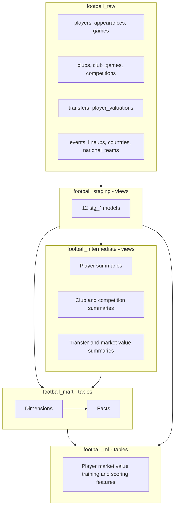

# Architecture and Model Catalog

## Overview

This project follows a layered dbt architecture on BigQuery. Each layer has a narrow responsibility:

1. Raw tables preserve the imported Kaggle dataset.
2. Staging views clean and normalize individual source tables.
3. Intermediate views calculate reusable business metrics.
4. Mart tables expose stable analytics-ready dimensions and facts.
5. Semantic models, exposures, analyses, and Power BI assets govern decision-facing consumption.
6. Snapshots preserve changing player and club profile history.
7. ML feature tables convert marts and historical sources into leakage-safe supervised-learning datasets.



## Dataset and Materialization Layout

| dbt area | BigQuery dataset | Materialization |
| --- | --- | --- |
| Source | `football_raw` | Existing tables |
| Staging | `<base>_staging` | Views |
| Intermediate | `<base>_intermediate` | Views |
| Marts | `<base>_mart` | Tables |
| ML | `<base>_ml` | Tables |
| Snapshots | `<base>_snapshots` | Type-2 snapshot tables |

With the base profile dataset `football`, dbt creates `football_staging`, `football_intermediate`, and `football_mart`.

## Operational Controls

- dbt version compatibility is constrained to `>=1.11.0,<2.0.0`.
- `dbt-bigquery` is pinned to `1.11.1`.
- Raw freshness uses BigQuery table last-modified metadata.
- Freshness warns after 7 days and errors after 14 days.
- Batch metadata freshness is enabled to reduce warehouse metadata calls.
- Relation and column descriptions are persisted to BigQuery.
- All 46 models and all 878 physical model columns have descriptions: 153 staging, 103 intermediate, 557 mart, and 65 ML columns.
- Two semantic models, seven governed metrics, three exposures, and a daily time spine define the consumption contract.
- Two Type-2 snapshots preserve changing player and club profile attributes.
- An append-only refresh audit and volume-stability test guard material refresh changes.
- Named selectors support layer builds, upstream mart builds, and raw source freshness.
- GitHub Actions validates pull requests in isolated BigQuery datasets and deploys `main`.

## Staging Models

Staging models retain source grain while standardizing names, types, whitespace, and known sentinel values.

| Model | Source | Grain | Main responsibility |
| --- | --- | --- | --- |
| `stg_players` | `players` | Player | Clean profile fields, validate height, cast dates |
| `stg_appearances` | `appearances` | Appearance | Normalize current club sentinel and player-game statistics |
| `stg_games` | `games` | Game | Clean game, score, attendance, and formation fields |
| `stg_club_games` | `club_games` | Game and club | Represent each match from each club's perspective |
| `stg_clubs` | `clubs` | Club | Clean current club profile |
| `stg_competitions` | `competitions` | Competition | Clean competition metadata |
| `stg_transfers` | `transfers` | Transfer record | Clean names and cast monetary fields to `NUMERIC` |
| `stg_player_valuations` | `player_valuations` | Player and valuation date | Clean market value history |
| `stg_game_events` | `game_events` | Event | Normalize minute sentinel, type, and empty description |
| `stg_game_lineups` | `game_lineups` | Lineup record | Normalize lineup type and position |
| `stg_countries` | `countries` | Country | Clean country metadata |
| `stg_national_teams` | `national_teams` | National team | Clean national team metadata |

## Intermediate Models

| Model | Grain | Main calculations |
| --- | --- | --- |
| `int_player_performance_summary` | Player | Matches, goals, assists, cards, minutes, per-match and per-90 metrics |
| `int_player_market_value_summary` | Player | First, latest, highest value, growth, and latest club |
| `int_transfer_summary` | Player | Transfer count, fees, and deterministic latest transfer |
| `int_player_profile` | Player | Enriched profile combining performance, value, and transfer summaries |
| `int_player_season_performance` | Player, season, competition | Seasonal performance and latest eligible market value |
| `int_club_performance_summary` | Club | Results, goals, goal difference, win rate, and averages |
| `int_competition_summary` | Competition | Matches, goals, attendance, and distinct participating clubs |

### Important Business Definitions

**Player age**

Age is calculated in completed years using the current date and the player's birthday, rather than a simple year difference.

**Per-90 metrics**

```text
goals_per_90 = total_goals / total_minutes_played * 90
assists_per_90 = total_assists / total_minutes_played * 90
```

Division by zero is protected with `SAFE_DIVIDE` and `NULLIF`.

**Season market value**

For each player-season-competition record, the selected market value is the latest available valuation on or before that player's last match date in the group. Future valuations are not applied retroactively.

**Latest transfer**

The latest transfer is ordered by transfer date and deterministic secondary fields. This prevents unstable results when multiple transfer rows share a date.

**Transfer market value baseline**

The detailed transfer analysis prefers the market value recorded directly on the transfer row. When that value is unavailable, it uses the latest player valuation on or before the transfer date. The baseline source is exposed on every row.

**Post-transfer market value change**

Post-transfer change compares the selected market value baseline with the first available player valuation after the transfer date. Both valuation dates and the number of days between them are retained for auditability.

## Mart Models

### Dimensions

| Model | Grain | Coverage rule |
| --- | --- | --- |
| `dim_players` | Player | Includes current players plus historical players found only in appearances |
| `dim_clubs` | Club | Includes current clubs plus clubs referenced by games, transfers, valuations, and players |
| `dim_competitions` | Competition | Preserves staged competition records |
| `dim_national_teams` | National team | Preserves staged national-team records |
| `dim_date` | Calendar date | Continuous range from the earliest source date through the latest source date or today |
| `time_spine_daily` | Calendar date | Daily MetricFlow Semantic Layer time spine |

Historical dimension records can contain `NULL` descriptive attributes when the source data provides only an identifier. This is intentional and preserves fact-table referential integrity.

`dim_players` and `dim_clubs` expose canonical nullable attributes together with Power BI-safe display labels, current-versus-historical record types, and profile completeness metrics. Display labels prevent blank visual categories without replacing or corrupting the canonical source values.

### Facts

| Model | Grain | Primary inputs |
| --- | --- | --- |
| `fct_player_performance` | Player | `int_player_performance_summary`, `int_player_profile` |
| `fct_player_career_timeline` | Player, season, competition | `int_player_season_performance`, `dim_players` |
| `fct_club_performance` | Club | `int_club_performance_summary`, `dim_clubs` |
| `fct_competition_performance` | Competition | `int_competition_summary` |
| `fct_market_value_history` | Player and valuation date | `stg_player_valuations`, `dim_players` |
| `fct_transfers` | Transfer record | `stg_transfers`, `dim_players` |
| `fct_transfer_market_value_analysis` | Transfer record | `stg_transfers`, `stg_player_valuations`, player summaries, dimensions |
| `fct_transfer_fixed_horizon_outcomes` | Historical transfer | Comparable 90/180/365-day outcomes and pre/post performance |
| `fct_transfer_cohort_performance` | Cohort and horizon | Robust cohort statistics, coverage, and reliability |
| `fct_data_coverage_bias` | Coverage segment | Missingness and selection-bias diagnostics |
| `fct_match` | Match | Match result, score, attendance, manager, and formation context |
| `fct_player_match_performance` | Appearance | Player-match performance, result, starter, and captain context |
| `fct_player_rolling_form` | Appearance | Trailing-five-appearance form |
| `fct_club_season_performance` | Club, season, competition | Seasonal club results and tactical context |
| `fct_club_transfer_portfolio` | Club and transfer season | Transfer spend, income, premium, outcome, and coverage |
| `fct_transfer_success_labels` | Observed 365-day transfer | Fixed-horizon binary success labels |
| `fct_club_risk_profile` | Destination club | Transfer success, coverage, sample-size, and risk profile |
| `fct_agent_portfolio` | Agent | Current represented-player portfolio |
| `fct_analytics_refresh_audit` | dbt invocation | Append-only volume and coverage audit |

### Transfer & Market Value Analysis

`fct_transfer_market_value_analysis` is the primary analytics surface for evaluating player transfers. 40,208 transfer records, 75 columns, partitioned by year, clustered by `player_id / to_club_id / from_club_id`.

**Market value baseline priority:**
1. Use `transfer_record_market_value` when the transfer row provides a value
2. Otherwise use the latest available valuation on or before the transfer date
3. Leave null when neither is available — never estimate

**Coverage (as of June 2026):**

| Coverage metric | Rows |
|---|---:|
| Total transfer records | 40,208 |
| Transfers with a known fee | 25,821 |
| Transfers with a market value baseline | 24,913 |
| Transfers with both fee and baseline | 20,001 |
| Transfers with a prior valuation | 24,886 |
| Transfers with a subsequent valuation | 35,077 |
| Transfers with post-transfer value change | 21,820 |
| Future-dated transfer records | 428 |

**Interpretation rules:**
- `fee_status = 'zero_fee'` means the source fee equals zero — not automatically a free transfer
- `fee_market_value_difference_pct` is null when fee or baseline is unavailable, or when baseline is zero
- Power BI measures must filter with `has_*` availability fields — never replace null monetary values with zero

**Example: fee premium by season**

```sql
select
    transfer_season,
    count(*) as comparable_transfers,
    round(avg(fee_market_value_difference_pct), 2) as avg_fee_premium_pct,
    round(avg(market_value_change_after_transfer_pct), 2) as avg_post_transfer_value_change_pct
from `football_mart.fct_transfer_market_value_analysis`
where has_fee_market_value_comparison
    and not is_future_transfer
group by transfer_season
order by transfer_season desc;
```

**Example: largest post-transfer value gains**

```sql
select
    player_name, transfer_date, from_club_name, to_club_name,
    transfer_fee, market_value_baseline, next_market_value,
    market_value_change_after_transfer_pct, days_to_next_valuation
from `football_mart.fct_transfer_market_value_analysis`
where has_post_transfer_value_change
    and days_to_next_valuation <= 365
    and not is_future_transfer
order by market_value_change_after_transfer desc
limit 100;
```

### KPI Reference

| KPI | Formula | Source model |
|---|---|---|
| Fee premium % | `(transfer_fee - market_value_baseline) / market_value_baseline * 100` | `fct_transfer_market_value_analysis` |
| 90/180/365-day value change % | Nearest valuation within ±30 days of horizon vs. transfer baseline | `fct_transfer_fixed_horizon_outcomes` |
| Outcome coverage % | Observed comparable outcomes / cohort transfers | `fct_transfer_cohort_performance` |
| Positive outcome rate % | Outcomes above baseline / observed outcomes | `fct_transfer_cohort_performance` |
| Net transfer spend | Known inbound fees − known outbound fees | `fct_club_transfer_portfolio` |
| Transfer success rate | 365-day outcomes with ≥20% growth / observed 365-day outcomes | `fct_club_risk_profile` |
| Goals per 90 | `goals / minutes_played * 90` | `fct_player_rolling_form` |
| Win rate % | `wins / matches_played * 100` | `fct_club_season_performance` |

**Statistical rules:** prefer median and IQR for skewed transfer outcomes; segment comparisons must report observed sample size; randomized A/B terminology is prohibited unless treatment assignment was randomized and logged.

## Semantic Layer, Exposures, And Snapshots

`models/semantic.yml` defines governed transfer-outcome and club-season metrics. `time_spine_daily` is the required daily time spine. `models/exposures.yml` records the Power BI and ML consumers and their upstream dependencies.

`snap_player_profiles` and `snap_club_profiles` use the check strategy to preserve changes in profile, club, agent, contract, squad, coach, and transfer-record fields. They are stored in `<base>_snapshots`, and scheduled production CI captures changes before normal model builds.

## ML Feature Model

| Model | Grain | Purpose |
| --- | --- | --- |
| `ml_player_market_value_training` | Player and season | Predict a positive season market value using only information available before its valuation date |
| `ml_player_market_value_scoring` | Active player in latest observed season | Generate current as-of-date feature rows for production scoring |

The ML feature model selects the latest eligible valuation for each player-season and aggregates performance across all competitions strictly before that target date. Prior valuation features also use strict `< target_market_value_date` logic. These rules are enforced by singular dbt tests.

The scikit-learn pipeline separates quality-segment ensemble tuning, interval calibration, and temporal backtesting by season instead of using a random row split. Limited-quality predictions use a governed previous-value baseline fallback, while high- and medium-quality weights are selected on the tuning season. After evaluation, the production artifact retrains on all labeled rows. A feature contract validates required inputs, blocking release gates prevent weak models or weak quality segments from publishing, and artifact checksums plus source/runtime metadata support reproducibility. It publishes versioned current predictions, segment metrics, permutation importance, quality gates, feature-drift monitoring, and an append-only model registry. Full methodology and results are documented in [Player Market Value ML](PLAYER_MARKET_VALUE_ML.md).

## Referential Integrity

The mart schema tests non-null foreign keys against their dimensions:

- Player facts to `dim_players`
- Club facts and transfer club identifiers to `dim_clubs`
- Competition facts and career records to `dim_competitions`
- Player current clubs to `dim_clubs`
- Transfer, valuation, and seasonal market-value dates to `dim_date`

The June 15, 2026 validation found zero non-null fact-to-dimension orphan keys.

## Design Decisions

- Staging and intermediate layers are views to minimize storage duplication.
- Marts are tables to provide stable BI query performance.
- Transformations preserve raw records unless a documented invalid identifier or field value requires normalization.
- Historical dimension coverage is preferred over dropping valid fact records.
- Exact numeric types are used for transfer money to avoid floating-point reconciliation issues.
- Tests independently recalculate critical metrics rather than only checking row existence.
- Unknown monetary values remain `NULL`, not zero, so averages and totals do not treat unavailable data as a confirmed zero value.
- Fact tables expose non-null `has_*` availability flags so BI measures can explicitly select valid comparison populations.

## Power BI Consumption

Power BI should connect to `football_mart`, use the dimension tables on the one-side of relationships, and use `dim_date` for time intelligence. Date relationships that are not the primary reporting date should be inactive role-playing relationships or separate date-dimension aliases in Power BI.

Use `player_name_display`, `position_display`, `current_club_name_display`, and `club_name_display` in visuals. Use canonical nullable columns for data-quality analysis. Before calculating an average, ratio, or comparison from optional monetary values, filter with the corresponding `has_*` field.

The complete relationship, NULL, and measure guidance is documented in [Power BI Modeling Guide](POWER_BI_MODELING.md).

Full ML methodology, commands, interpretation, and limitations → [Player Market Value ML](PLAYER_MARKET_VALUE_ML.md)
