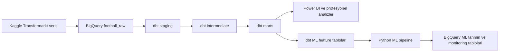

# Football Player Performance Analysis - Ekip Proje Raporu

## 1. Rapor Ozeti

Bu rapor, Kaggle'daki Transfermarkt futbol verisinin BigQuery, dbt, Python/scikit-learn ve Power BI icin uretime hazir bir analitik urune donusturulmesi sirasinda yapilan calismalari bastan sona aciklar.

Projenin ana hedefleri:

- Ham futbol verisini guvenilir ve tekrar kullanilabilir veri modellerine donusturmek
- Oyuncu, kulup, mac, transfer ve piyasa degeri analizlerini desteklemek
- Transfer ve Piyasa Degeri Analizi icin ayrintili ve yonetilen mart tablolar olusturmak
- Oyuncu piyasa degeri tahmini icin leakage-safe bir ML sistemi gelistirmek
- Veri, model ve deployment kalitesini otomatik testlerle guvence altina almak
- Power BI dashboard gelistirmesi icin belgeli ve kontrollu bir tuketim katmani sunmak

15 Haziran 2026 itibariyla dbt ve ML production workflow'lari basariyla calismis, modeller BigQuery'ye deploy edilmis ve repository `main` branch'i ile senkronize edilmistir.

## 2. Kullanilan Veri ve Teknoloji

### Veri Kaynagi

- Kaynak: Kaggle - Football Data from Transfermarkt
- Ham tablo sayisi: 12
- BigQuery ham veri seti: `football_raw`
- Veri; oyuncular, kulupler, maclar, gorunumler, transferler, piyasa degerleri, etkinlikler, kadrolar, ulkeler ve milli takimlari kapsar.

### Teknoloji Mimarisi

| Alan | Teknoloji | Sorumluluk |
| --- | --- | --- |
| Veri ambari | Google BigQuery | Ham veri, dbt modelleri ve ML ciktilari |
| Donusum | dbt + dbt-bigquery | Katmanli veri modelleme, test ve dokumantasyon |
| ML | Python + scikit-learn | Piyasa degeri egitimi, backtest, scoring ve monitoring |
| CI/CD | GitHub Actions | Otomatik freshness, build, test, docs ve ML production |
| BI | Power BI | Karar destek dashboard'lari |
| Versiyon kontrolu | GitHub | Kod, analiz, dokumantasyon ve yonetilen BI varliklari |

## 3. dbt Veri Donusum Calismalari

### 3.1 Staging Katmani

12 ham kaynak icin 12 staging view olusturuldu. Bu katmanda:

- Kolon adlari standartlastirildi.
- Veri tipleri BigQuery icin guvenli bicimde donusturuldu.
- Bos metinler ve bilinen sentinel degerler `NULL` olarak normalize edildi.
- Gecersiz oyuncu boylari filtrelendi.
- Transfer ve piyasa degeri alanlari `NUMERIC` olarak modellendi.
- Kaynak grain'i korunarak downstream katmanlar icin stabil bir kontrat olusturuldu.

Staging katmanindaki 153 fiziksel kolonun tamami belgelendi.

### 3.2 Intermediate Katmani

Tekrar kullanilabilir is hesaplamalari icin 7 intermediate view olusturuldu:

- Oyuncu performans ozeti
- Oyuncu piyasa degeri ozeti
- Transfer ozeti
- Birlesik oyuncu profili
- Oyuncu-sezon-rekabet performansi
- Kulup performans ozeti
- Rekabet performans ozeti

Bu katmanda yas, per-90 metrikleri, sezonluk piyasa degeri secimi ve deterministik son transfer gibi temel is kurallari merkezi hale getirildi.

Intermediate katmanindaki 103 fiziksel kolonun tamami belgelendi.

### 3.3 Mart Katmani

Power BI, analiz ve ML tuketimi icin toplam 25 mart tablo olusturuldu. Mart katmani:

- Oyuncu, kulup, rekabet, milli takim ve tarih boyutlarini
- Oyuncu, kulup, mac ve rekabet performans fact tablolarini
- Transfer ve piyasa degeri fact tablolarini
- Cohort, coverage, risk, agent ve refresh audit tablolarini kapsar.

Mart katmanindaki 557 fiziksel kolonun tamami belgelendi.

## 4. Transfer ve Piyasa Degeri Analizi

Transfer ve Piyasa Degeri Analizi icin tek bir basit transfer tablosu yerine farkli karar ihtiyaclarini destekleyen profesyonel bir model ailesi olusturuldu.

### Ana Tablolar

| Model | Grain | Kullanim |
| --- | --- | --- |
| `fct_transfer_market_value_analysis` | Bir transfer kaydi | Ucret, piyasa degeri baseline'i ve sonraki deger analizi |
| `fct_transfer_fixed_horizon_outcomes` | Bir tarihsel transfer | Karsilastirilabilir 90/180/365 gunluk sonuclar |
| `fct_transfer_cohort_performance` | Cohort ve zaman ufku | Orneklem ve guvenilirlik kontrollu cohort analizi |
| `fct_data_coverage_bias` | Coverage segmenti | Eksik veri ve selection-bias riski |
| `fct_club_transfer_portfolio` | Kulup ve transfer sezonu | Harcama, gelir, prim ve outcome portfoyu |
| `fct_transfer_success_labels` | Gozlemlenmis 365 gunluk transfer | Sabit zaman ufuklu basari etiketi |
| `fct_club_risk_profile` | Hedef kulup | Coverage ve minimum orneklem kontrollu kulup riski |

### Yapilan Temel Iyilestirmeler

- Transfer ucreti ile piyasa degeri baseline'i ayrildi.
- Baseline kaynagi her kayitta acikca belirtildi.
- Degisken "ilk sonraki deger" yaklasimi yerine 90, 180 ve 365 gunluk sabit outcome pencereleri getirildi.
- Outcome durumlari `observed`, `missing_baseline`, `not_yet_observable` ve `missing_followup` olarak ayrildi.
- Transfer basarisi yalnizca gozlemlenmis 365 gunluk sonuclarda ve en az yuzde 20 deger artisi ile tanimlandi.
- Kulup risk siniflandirmasinda minimum 30 karsilastirilabilir outcome zorunlulugu getirildi.
- Cohort analizlerine orneklem buyuklugu, medyan, IQR, standart sapma, guven araligi, coverage ve reliability alanlari eklendi.

### Mevcut Coverage

| Metrik | Coverage |
| --- | ---: |
| Bilinen transfer ucreti | 63.85% |
| Piyasa degeri baseline'i | 61.61% |
| Ucret-piyasa degeri karsilastirmasi | 49.27% |
| 90 gunluk outcome | 15.86% |
| 180 gunluk outcome | 24.39% |
| 365 gunluk outcome | 21.58% |

Genel transfer outcome popülasyonu `high_bias_risk` olarak siniflandirilmistir. Bu nedenle dashboard'larda outcome sonucu ile coverage birlikte gosterilmeli ve eksik follow-up bulunan tum transferlere genelleme yapilmamalidir.

## 5. Profesyonel Analitik Katman

Projeye yalnizca temel raporlama tablolari degil, karar verme kalitesini artiran profesyonel analiz varliklari da eklendi:

- Mac ve oyuncu-mac performansi
- Son bes gorunumluk rolling form
- Kulup-sezon-rekabet performansi
- Kulup transfer portfoyu
- Agent portfoyu
- Transfer cohort analizi
- Veri coverage ve bias analizi
- Refresh hacim ve coverage audit'i
- Yonetilen Semantic Layer metrikleri

Toplam 5 versiyon kontrollu analiz bulunur:

- Transfer cohort karar raporu
- Transfer matched observational comparison
- Manager ve formation benchmark
- Agent portfoy benchmark
- Data coverage release gate

Kaynak veride randomized assignment ve experiment exposure bilgisi olmadigi icin calismalar yanlis bicimde A/B testi olarak adlandirilmadi. Mevcut karsilastirmalar observational ve associative olarak tanimlandi.

## 6. Veri Kalitesi, Test ve Yonetişim

### dbt Test Kapsami

Toplam 241 dbt testi basariyla gecmektedir. Testler:

- Kaynak identifier ve grain kontrolleri
- Unique ve not-null kontrolleri
- Fact-dimension relationship kontrolleri
- Katmanlar arasi row coverage kontrolleri
- Kaynaktan yeniden hesaplama ve reconciliation testleri
- Transfer, piyasa degeri, yas ve per-90 is kurali testleri
- ML feature leakage ve readiness testleri
- Profesyonel mart grain ve hesaplama testleri
- Snapshot history ve refresh volume anomaly testlerini kapsar.

### Freshness

- 12 ham kaynagin tamami freshness kontrolunden gecti.
- Freshness, tarihsel is tarihi yerine BigQuery tablo son degistirilme metadata'si ile olculur.
- 7 gunden sonra warning, 14 gunden sonra error uretilir.

### Dokumantasyon

| Katman | Belgelenen kolon |
| --- | ---: |
| Staging | 153 / 153 |
| Intermediate | 103 / 103 |
| Mart | 557 / 557 |
| ML | 65 / 65 |
| Toplam | 878 / 878 |

Tum 46 model belgelenmistir. Dokumantasyon coverage'i CI icinde otomatik kontrol edilmektedir.

### Ek Yonetişim Varliklari

- 2 Type-2 snapshot: oyuncu ve kulup profil gecmisi
- 2 semantic model
- 7 governed metric
- 3 exposure
- Gunluk time spine
- Append-only analytics refresh audit
- Yuzde 50'den buyuk kritik hacim degisimini engelleyen anomaly testi

## 7. Oyuncu Piyasa Degeri ML Sistemi

### Problem Tanimi

ML sistemi, oyuncunun hedef tarihten once bilinen profil, rekabet, performans ve onceki piyasa degeri bilgilerini kullanarak pozitif sezonluk piyasa degerini tahmin eder.

Transfermarkt piyasa degeri bir kaynak tahminidir; gerceklesen transfer ucreti veya objektif finansal deger degildir.

### Feature ve Leakage Kontrolleri

- Training grain: bir oyuncu ve sezon
- Training feature satiri: 90,704
- Current scoring satiri: 7,841
- Performans ve onceki deger feature'lari hedef tarihten kesinlikle onceki kayitlardan uretilir.
- Rastgele train/test split kullanilmaz.
- 2022: ensemble weight tuning
- 2023: prediction interval calibration
- 2024-2025: temporal backtest ve release gate
- Final production model: 2025 dahil tum uygun etiketli satirlarda yeniden egitilir.

### Model Yaklasimi

Histogram Gradient Boosting modeli, onceki piyasa degeri baseline'i ile tahmin kalitesine gore birlestirildi:

- `high`: yuzde 80 ML + yuzde 20 baseline
- `medium`: yuzde 100 ML
- `limited`: yuzde 100 yonetilen baseline fallback

Bu yaklasim, eksik baglama sahip oyuncular icin guvenilir olmayan ML tahminlerini karar raporlarina zorla dahil etmez.

### Son Backtest Sonuclari

| Metrik | Ensemble | Onceki deger baseline'i |
| --- | ---: | ---: |
| MAE | EUR 781,409 | EUR 867,156 |
| RMSE | EUR 2,039,156 | EUR 2,248,309 |
| R2 | 0.9756 | 0.9704 |
| WAPE | 12.51% | 13.88% |
| Tahminlerin gercek degerin yuzde 25'i icinde olma orani | 74.71% | 74.71% |

Ensemble model, baseline'a gore MAE'yi yuzde 9.89 iyilestirmistir.

### ML Production ve Release Gate'leri

Son production modeli:

`player_market_value_hgbr_v5_20260615T145011Z_43f7b93f`

Release durumu:

`approved_with_monitoring`

Yedi blocking kalite kapisinin tamami basariyla gecmistir:

- Baseline'a gore MAE iyilesmesi
- Onceki champion modele gore MAE regression siniri
- Held-out WAPE
- Held-out R2
- Genel prediction interval coverage
- EUR 20M+ oyuncu interval coverage
- En kotu prediction-quality segmentinin baseline'in altina dusmemesi

### ML Testleri ve Denetim

- Synthetic pipeline smoke testleri
- Missing ve categorical deger isleme testleri
- Feature ve metadata contract testleri
- Leakage ve feature tarih siniri testleri
- Segment metrikleri ve minimum 30 orneklem kontrolu
- Prediction interval ve negatif tahmin kontrolleri
- Artifact SHA-256 checksum kontrolu
- Feature contract hash kontrolu
- Published BigQuery tablolarinda model-version tutarliligi
- Feature drift ve prediction readiness kontrolleri
- Production release gate testleri

### Aktif ML Izleme Uyarilari

- Current tahminlerin yuzde 27.09'u `limited` kalite durumundadir.
- 10 feature'da current scoring popülasyonu ile referans popülasyon arasinda significant PSI drift vardir.
- Bu sinyaller pipeline hatasi degildir; analyst review gerektiren uretim monitoring uyarilaridir.
- Decision-facing dashboard'larda yalnizca `high` ve `medium` tahminler kullanilmalidir.

## 8. Power BI Hazirligi

Dashboard gelistirmesi icin mart ve ML tuketim kontrati hazirlandi:

- `powerbi/MODEL_SPEC.md`: desteklenen sayfalar ve karar kurallari
- `powerbi/MEASURES.dax`: versiyon kontrollu DAX olculeri
- `docs/KPI_DICTIONARY.md`: KPI tanimlari ve popülasyon kurallari
- `docs/POWER_BI_MODELING.md`: star schema, iliskiler, NULL ve refresh kurallari

Power BI dogrudan staging veya intermediate katmanina baglanmamalidir. Ana tuketim katmani `football_mart`, ML sayfalari icin desteklenen katman `football_ml` olmalidir.

### Onerilen Dashboard Sayfalari

1. Executive Overview
2. Transfer and Market Value
3. Player Performance and Rolling Form
4. Club and Competition Performance
5. ML Market Value Predictions
6. Data Quality and ML Monitoring

### Dashboard'da Zorunlu Yonetisim Kurallari

- Bilinmeyen parasal degerler sifira cevrilmemeli.
- Transfer outcome metrikleri coverage ile birlikte gosterilmeli.
- `insufficient_data` kulüpler karar siralamasina dahil edilmemeli.
- ML tahminlerinde point estimate ile birlikte prediction interval gosterilmeli.
- `limited` tahminler ana karar sayfalarindan ayrilmali.
- Segment performansi icin `meets_minimum_sample_size = TRUE` filtresi uygulanmali.
- Power BI refresh oncesinde freshness, dbt build, snapshot, coverage audit ve ML blocking gate'leri kontrol edilmeli.

## 9. CI/CD ve Deployment

### dbt CI

dbt CI workflow'u:

- BigQuery baglantisini ve projeyi dogrular.
- ML pipeline smoke testini calistirir.
- Kaynak freshness kontrolunu yapar.
- Type-2 snapshot'lari olusturur ve history testini calistirir.
- Tum dbt modellerini build eder ve test eder.
- dbt dokumantasyonunu uretir.
- Yuzde 100 model ve kolon dokumantasyon coverage'ini dogrular.
- dbt artifact'larini GitHub Actions'a yukler.
- Pull request'ler icin izole dataset'ler kullanir ve temizler.

Son basarili dbt CI:

- Commit: `a06c80a42a5e7c2b2f680238d0ad0e3507e7237d`
- Run: <https://github.com/ilknurdenizozturk/football-player-performance-analysis/actions/runs/27554617655>

### ML Production

ML Production workflow'u:

- Freshness kontrolu yapar.
- ML feature modellerini build eder.
- Modeli egitir, temporal backtest uygular ve release gate'leri calistirir.
- Basarili adayi BigQuery'ye publish eder.
- Artifact ve published output tutarliligini dogrular.
- Yonetilen ML artifact'larini saklar.

Son basarili ML Production:

- Commit: `a06c80a42a5e7c2b2f680238d0ad0e3507e7237d`
- Run: <https://github.com/ilknurdenizozturk/football-player-performance-analysis/actions/runs/27554620904>

## 10. Uretim Durumu

| Kontrol | Sonuc |
| --- | ---: |
| dbt model | 46 |
| Mart model | 25 |
| dbt test | 241 / 241 basarili |
| Raw freshness | 12 / 12 basarili |
| Model dokumantasyonu | 46 / 46 |
| Kolon dokumantasyonu | 878 / 878 |
| Snapshot | 2 |
| Analiz | 5 |
| Exposure | 3 |
| Governed metric | 7 |
| Current ML tahmini | 7,841 |
| Null ML tahmini | 0 |
| Blocking ML gate | 7 / 7 basarili |

Proje dbt, profesyonel analitik, ML ve ML testleri acisindan uretim ve dashboard gelistirmesine hazirdir.

## 11. Bilinen Sinirlar ve Riskler

Teknik pipeline'in basarili olmasi, ham kaynagin eksiksiz oldugu anlamina gelmez. Ekip asagidaki riskleri karar raporlarinda gorunur tutmalidir:

- 365 gunluk transfer outcome coverage'i yuzde 21.58'dir.
- Transfer outcome genel popülasyonu `high_bias_risk` durumundadir.
- Bilinmeyen transfer ucretleri ve piyasa degerleri kaynaktan gelmektedir.
- Current ML tahminlerinin yuzde 27.09'u `limited` durumundadir.
- 10 ML feature'inda significant drift vardir.
- Transfermarkt piyasa degeri tahmini, gerceklesen transfer fiyati degildir.
- Mevcut observational analizler nedensellik veya A/B test sonucu olarak yorumlanmamalidir.

## 12. Ekip Icin Calisma Kurallari

1. Yeni analizlerde staging ve intermediate yerine desteklenen mart tablolari kullanilmalidir.
2. Yeni model veya kolonlar dbt dokumantasyonu ve uygun test olmadan merge edilmemelidir.
3. Transfer outcome analizlerinde coverage ve sample-size bilgisi zorunlu tutulmalidir.
4. Unknown para degerleri sifir olarak modellenmemelidir.
5. ML dashboard'lari yalnızca tum blocking gate'ler gectiginde yenilenmelidir.
6. Significant drift ve `limited` tahmin payi her ML refresh sonrasinda incelenmelidir.
7. Yeni KPI'lar KPI dictionary, Semantic Layer veya DAX kontratinda tanimlanmalidir.
8. Production degisikligi oncesinde CI ve ilgili runbook checklist'i basariyla tamamlanmalidir.

## 13. Sonuc

Proje, ham Transfermarkt verisini test edilmis ve belgelenmis dbt katmanlarina, profesyonel transfer ve performans analizlerine, yonetilen bir ML production sistemine ve Power BI icin kontrollu bir tuketim katmanina donusturmustur.

En onemli sonuc yalnizca model ve dashboard verisi uretilmesi degildir. Veri coverage'i, ML drift'i, orneklem yeterliligi, prediction quality ve deployment durumu da karar surecinin bir parcasi haline getirilmistir. Bu nedenle ekip dashboard gelistirmesine gecebilir; ancak raporlarda tanimlanan kalite ve coverage kurallarini korumaya devam etmelidir.
