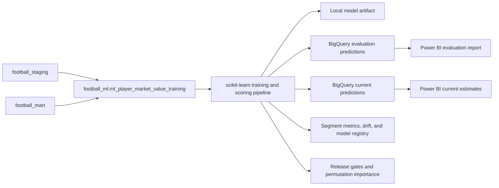

# Player Market Value Prediction

## Objective

The workflow predicts a player's positive market value for a season using profile, competition-context, prior-valuation, and match-performance information available before the target valuation date.

This is a supervised regression problem. The Transfermarkt market value is a source estimate, not a completed transaction price or objective financial valuation.

## Architecture



The dbt model owns feature engineering and data-quality tests. The Python pipeline owns feature-contract validation, time splitting, fitting, baseline comparison, interval calibration, release gating, explainability, artifact governance, and prediction publishing.

## Training Grain and Target

One training row represents one player and season.

For each player-season, the target is the latest positive eligible market value in that season:

- `target_market_value_date`
- `target_market_value_eur`

The current BigQuery training feature table contains 90,704 rows.

`ml_player_market_value_scoring` contains one row for each player active in the latest observed season. It uses appearances and valuations available through the build date. The current scoring table contains 7,841 rows.

## Leakage Controls

Random row splitting is not used.

- Performance features include appearances strictly before `target_market_value_date`.
- Previous-value features include valuations strictly before `target_market_value_date`.
- Current club identifiers, current market value, transfer outcomes, and future valuations are excluded.
- Season 2022 is used only to select high- and medium-quality ensemble weights.
- Limited-quality predictions use a governed previous-value baseline fallback.
- Season 2023 is used only to calibrate the 90% conformal prediction interval.
- Seasons 2024 and 2025 form the temporal backtest and release-gating set.
- The code does not use the backtest seasons for fitting, automated weight selection, or interval calibration.
- The final production artifact is retrained on all 90,704 labeled rows after evaluation.

The dbt tests `assert_ml_features_precede_target`, `assert_ml_training_row_coverage`, `assert_ml_feature_business_rules`, `assert_ml_model_coverage`, and `assert_ml_scoring_readiness` enforce date boundaries, target coverage, feature validity, and scoring readiness.

GitHub CI runs a synthetic pipeline smoke test on every relevant change. It validates preprocessing, missing-value handling, fitting, prediction, quality-segment ensemble-weight selection, limited-quality fallback enforcement, governed segment metrics, sample-size controls, and metric calculation without publishing or retraining production predictions.

The separate `ML Production` workflow runs weekly and on demand. It refreshes the dbt ML models, trains and evaluates the model, blocks publication on release-gate failure, publishes approved outputs, and retains governed artifacts for 30 days.

Profile attributes such as position, preferred foot, citizenship, and height come from the current player profile source. They are relatively stable attributes but remain a known historical-modeling limitation.

## Feature Groups

| Group | Examples |
| --- | --- |
| Player profile | Position, sub-position, preferred foot, height, citizenship, age at target date |
| Target context | Season, target valuation domestic competition, competition type, country, confederation |
| Performance before target | Matches, competitions, minutes, goals, assists, cards, goals and assists per 90 |
| Valuation history before target | Previous value, days since previous value, prior valuation count, prior highest value |

Missing optional values are imputed inside the scikit-learn pipeline. Unknown monetary values are not converted to zero in dbt. Implausible ages outside 10-60 are normalized to `NULL` in the ML feature layer before imputation.

## Model

The validated prediction uses quality-aware routing:

```text
high prediction    = 0.80 * histogram_gradient_boosting_prediction
                   + 0.20 * previous_market_value_baseline
medium prediction  = 1.00 * histogram_gradient_boosting_prediction
limited prediction = 1.00 * previous_market_value_baseline
```

High- and medium-quality weights were selected by minimizing MAE on the 2022 tuning season. Limited-quality predictions deliberately use the auditable baseline because sparse-context rows are not reliable enough for model-led publishing. A blocking release gate prevents any quality segment from performing below its baseline in the temporal backtest. Absolute residuals from the separate 2023 calibration season produce 90% conformal intervals by predicted-value band. The evaluation model is then retrained through 2023 before backtesting 2024-2025.

## Latest Results

| Metric | Ensemble model | ML-only model | Previous-value baseline |
| --- | ---: | ---: | ---: |
| MAE | EUR 781,409 | EUR 812,197 | EUR 867,156 |
| RMSE | EUR 2,039,156 | EUR 2,296,134 | EUR 2,248,309 |
| R2 | 0.9756 | 0.9691 | 0.9704 |
| WAPE | 12.51% | 13.00% | 13.88% |
| Median absolute percentage error | 13.23% | 13.88% | 14.29% |
| Predictions within 25% of actual | 74.71% | 71.20% | 74.71% |

The quality-aware ensemble reduces backtest MAE by 9.89% and WAPE by 1.37 percentage points versus the previous-value baseline. It also reduces MAE by 2.84% versus the previous v4 production champion. The band-calibrated 90% prediction intervals cover 89.63% of backtest targets overall.

| Prediction quality | Held-out rows | MAE improvement versus baseline |
| --- | ---: | ---: |
| `high` | 5,198 | 12.90% |
| `medium` | 1,967 | 18.22% |
| `limited` | 5,215 | 0.00% baseline fallback |

| Predicted-value band | Interval half-width |
| --- | ---: |
| Under EUR 1M | EUR 200,000 |
| EUR 1M-5M | EUR 968,857 |
| EUR 5M-20M | EUR 3,501,271 |
| EUR 20M+ | EUR 7,790,810 |

Band calibration produces 83.66% backtest coverage for actual EUR 20M+ players.

## Production Release Gates

The pipeline evaluates every candidate before publishing any BigQuery prediction output:

| Blocking gate | Requirement | Latest |
| --- | ---: | ---: |
| MAE improvement versus baseline | `> 0%` | `9.89%` |
| Held-out WAPE | `<= 15%` | `12.51%` |
| Held-out R2 | `>= 0.95` | `0.9756` |
| Overall interval coverage | `>= 85%` | `89.63%` |
| EUR 20M+ interval coverage | `>= 80%` | `83.66%` |
| Worst quality-segment improvement versus baseline | `>= 0%` | `0.00%` |
| MAE regression versus latest approved champion | `<= 2%` | `-2.84%` |

The latest v5 release status is `approved_with_monitoring`. All blocking gates pass. Two warning gates require review but do not reject the release:

- Current `limited` prediction share is 27.09%, above the 25% warning threshold.
- Ten features show significant PSI drift versus the latest labeled season.

## Explainability and Reproducibility

Held-out permutation importance is published for the ML component. The strongest current signals are previous market value, age, minutes, goals, and competition. Importance describes predictive dependence, not causal impact.

Every production artifact records:

- Feature contract and SHA-256 contract hash
- Model artifact SHA-256 checksum
- Source Git commit SHA
- Python, pandas, NumPy, scikit-learn, and joblib versions
- Training, tuning, calibration, and test season boundaries
- Release status and quality-gate outcomes

Current predictions are classified by feature readiness:

| Quality status | Rows |
| --- | ---: |
| `high` | 4,393 |
| `medium` | 1,324 |
| `limited` | 2,124 |

Use `high` and `medium` for decision-facing reports. Limited-quality point estimates are the governed baseline fallback, while `ml_only_prediction_eur` remains available for audit. Keep `limited` visible only for completeness and data-quality review.

## Run Locally

```bash
pip install -r requirements-ml.txt
dbt build --select tag:ml
python scripts/train_player_market_value.py \
  --project-id data-analiz-490513 \
  --credentials /absolute/path/to/service-account.json \
  --test-seasons 2 \
  --publish-predictions-table ml_player_market_value_evaluation_predictions \
  --publish-current-predictions-table ml_player_market_value_current_predictions \
  --publish-evaluation-metrics-table ml_player_market_value_evaluation_metrics \
  --publish-drift-table ml_player_market_value_feature_drift \
  --publish-model-registry-table ml_player_market_value_model_registry \
  --publish-feature-importance-table ml_player_market_value_feature_importance \
  --publish-quality-gates-table ml_player_market_value_quality_gates
```

Local outputs:

- `artifacts/player_market_value/model.joblib`
- `artifacts/player_market_value/metrics.json`
- `artifacts/player_market_value/test_predictions.csv`
- `artifacts/player_market_value/current_predictions.csv`
- `artifacts/player_market_value/evaluation_metrics.csv`
- `artifacts/player_market_value/feature_drift.csv`
- `artifacts/player_market_value/feature_importance.csv`
- `artifacts/player_market_value/quality_gates.csv`
- `artifacts/player_market_value/feature_contract.json`
- `artifacts/player_market_value/artifact_manifest.json`

Published BigQuery output:

- `football_ml.ml_player_market_value_evaluation_predictions`
- `football_ml.ml_player_market_value_current_predictions`
- `football_ml.ml_player_market_value_evaluation_metrics`
- `football_ml.ml_player_market_value_feature_drift`
- `football_ml.ml_player_market_value_model_registry`
- `football_ml.ml_player_market_value_feature_importance`
- `football_ml.ml_player_market_value_quality_gates`

The evaluation table contains 12,380 temporal-backtest historical predictions and must not be presented as a live forecast. The current-predictions table contains 7,841 as-of-date estimates. The metrics table contains overall and governed season, position, sub-position, age-band, competition, country, value-band, previous-value-availability, and quality-segment evaluation. Every segment row exposes a 30-row minimum-sample rule. The drift table compares current scoring features with the latest labeled season. The importance table supports predictive-driver analysis. The gate table explains release decisions. The append-only registry preserves model versions, checksums, source versions, and evaluation metadata.

## Power BI Usage

Use the published evaluation table to analyze:

- Actual versus predicted market value
- Absolute error by season, position, player, and competition
- Largest over-predictions and under-predictions
- Error concentration among high-value players
- Ensemble performance versus the previous-value baseline

Relate it to `dim_players`, `dim_competitions`, and `dim_date` using `player_id`, `competition_id`, and `target_market_value_date`.

Use the current-predictions table for player value rankings, estimated-versus-last-known-value comparisons, and position or competition-level current estimates. Always display `prediction_as_of_date`, `prediction_quality_status`, `prediction_interval_band`, `prediction_lower_eur`, and `prediction_upper_eur`.

## Monitoring Rules

- dbt fails when scoring previous-value or competition-context missingness exceeds 35%, or age missingness exceeds 5%.
- PSI below `0.10` is stable, `0.10-0.25` requires monitoring, and `0.25+` is significant drift.
- Current scoring has 27.09% missing previous values, 28.59% missing competition context, and 0% missing age.
- Significant drift is retained as an operational signal, not suppressed. Review it before retraining or publishing decision-facing reports.
- BigQuery prediction outputs are published only after all blocking quality gates pass.
- A blocking gate rejects any candidate whose backtest prediction-quality segment performs below its baseline.

## Limitations and Next Scale Trigger

- Transfermarkt values are subjective estimates.
- Historical profile attributes are sourced from the current player profile snapshot.
- The model estimates observed valuation records and does not prove causal player value drivers.
- Rare elite-player values remain harder to predict because they have few comparable examples.
- Current estimates use the latest observed season and are not guaranteed next-transfer prices.
- Prediction intervals vary by predicted-value band but do not yet vary by position, competition, or feature-readiness segment.
- Significant feature drift and the large `limited` quality share require analyst review; limited point estimates intentionally fall back to the baseline.

The next scale trigger is shadow evaluation of alternative algorithms plus segment-specific calibration by position or competition once data volume supports stable estimates.
