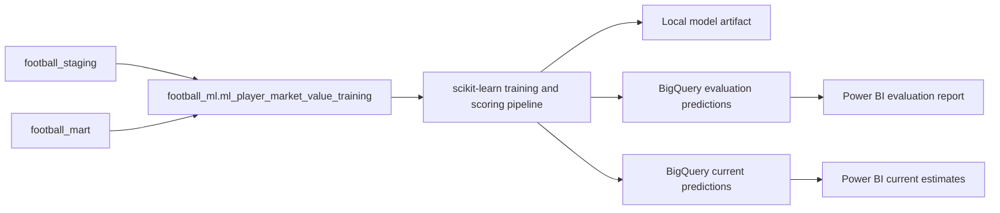

# Player Market Value Prediction

## Objective

The workflow predicts a player's positive market value for a season using profile, competition-context, prior-valuation, and match-performance information available before the target valuation date.

This is a supervised regression problem. The Transfermarkt market value is a source estimate, not a completed transaction price or objective financial valuation.

## Architecture



The dbt model owns feature engineering and data-quality tests. The Python pipeline owns time splitting, fitting, baseline comparison, evaluation, and optional prediction publishing.

## Training Grain and Target

One training row represents one player and season.

For each player-season, the target is the latest positive eligible market value in that season:

- `target_market_value_date`
- `target_market_value_eur`

The current BigQuery training feature table contains 90,704 rows.

`ml_player_market_value_scoring` contains one row for each player active in the latest observed season. It uses appearances and valuations available through the build date. The current scoring table contains 7,841 rows.

## Leakage Controls

Random row splitting is not used.

- Performance features include appearances strictly before `target_market_value_date`.
- Previous-value features include valuations strictly before `target_market_value_date`.
- Current club identifiers, current market value, transfer outcomes, and future valuations are excluded.
- Seasons 2024 and 2025 are fully held out for final testing.
- Season 2023 is used to select the ensemble weight.
- The test seasons are not used for fitting or ensemble-weight selection.

The dbt tests `assert_ml_features_precede_target` and `assert_ml_training_row_coverage` enforce the date boundary and target coverage.

GitHub CI runs a synthetic pipeline smoke test on every relevant change. It validates preprocessing, missing-value handling, fitting, prediction, ensemble-weight selection, and metric calculation without publishing or retraining production predictions.

Profile attributes such as position, preferred foot, citizenship, and height come from the current player profile source. They are relatively stable attributes but remain a known historical-modeling limitation.

## Feature Groups

| Group | Examples |
| --- | --- |
| Player profile | Position, sub-position, preferred foot, height, citizenship, age at target date |
| Target context | Season, target valuation domestic competition, competition type, country, confederation |
| Performance before target | Matches, competitions, minutes, goals, assists, cards, goals and assists per 90 |
| Valuation history before target | Previous value, days since previous value, prior valuation count, prior highest value |

Missing optional values are imputed inside the scikit-learn pipeline. Unknown monetary values are not converted to zero in dbt.

## Model

The validated prediction is an ensemble:

```text
prediction = 0.75 * histogram_gradient_boosting_prediction
           + 0.25 * previous_market_value_baseline
```

The `0.75` weight was selected by minimizing MAE on the 2023 validation season. The model is then retrained on all seasons through 2023 before evaluating 2024-2025.

## Latest Results

| Metric | Ensemble model | ML-only model | Previous-value baseline |
| --- | ---: | ---: | ---: |
| MAE | EUR 799,222 | EUR 812,197 | EUR 867,156 |
| RMSE | EUR 2,174,730 | EUR 2,296,134 | EUR 2,248,309 |
| R2 | 0.9723 | 0.9691 | 0.9704 |
| WAPE | 12.79% | 13.00% | 13.88% |
| Median absolute percentage error | 13.37% | 13.88% | 14.29% |

The ensemble improves every reported metric over the previous-value baseline on the held-out 2024-2025 seasons.

## Run Locally

```bash
pip install -r requirements-ml.txt
dbt build --select tag:ml
python scripts/train_player_market_value.py \
  --project-id data-analiz-490513 \
  --credentials /absolute/path/to/service-account.json \
  --test-seasons 2 \
  --publish-predictions-table ml_player_market_value_evaluation_predictions \
  --publish-current-predictions-table ml_player_market_value_current_predictions
```

Local outputs:

- `artifacts/player_market_value/model.joblib`
- `artifacts/player_market_value/metrics.json`
- `artifacts/player_market_value/test_predictions.csv`
- `artifacts/player_market_value/current_predictions.csv`

Published evaluation output:

- `football_ml.ml_player_market_value_evaluation_predictions`
- `football_ml.ml_player_market_value_current_predictions`

The evaluation table contains held-out historical predictions and must not be presented as a live forecast. The current-predictions table contains as-of-date estimates for players active in the latest observed season.

## Power BI Usage

Use the published evaluation table to analyze:

- Actual versus predicted market value
- Absolute error by season, position, player, and competition
- Largest over-predictions and under-predictions
- Error concentration among high-value players
- Ensemble performance versus the previous-value baseline

Relate it to `dim_players`, `dim_competitions`, and `dim_date` using `player_id`, `competition_id`, and `target_market_value_date`.

Use the current-predictions table for player value rankings, estimated-versus-last-known-value comparisons, and position or competition-level current estimates. Always display `prediction_as_of_date`.

## Limitations and Next Scale Trigger

- Transfermarkt values are subjective estimates.
- Historical profile attributes are sourced from the current player profile snapshot.
- The model estimates observed valuation records and does not prove causal player value drivers.
- Rare elite-player values remain harder to predict because they have few comparable examples.
- Current estimates use the latest observed season and are not guaranteed next-transfer prices.

The next scale trigger is to version prediction runs and add drift plus segment-level error monitoring before automating scheduled retraining.
